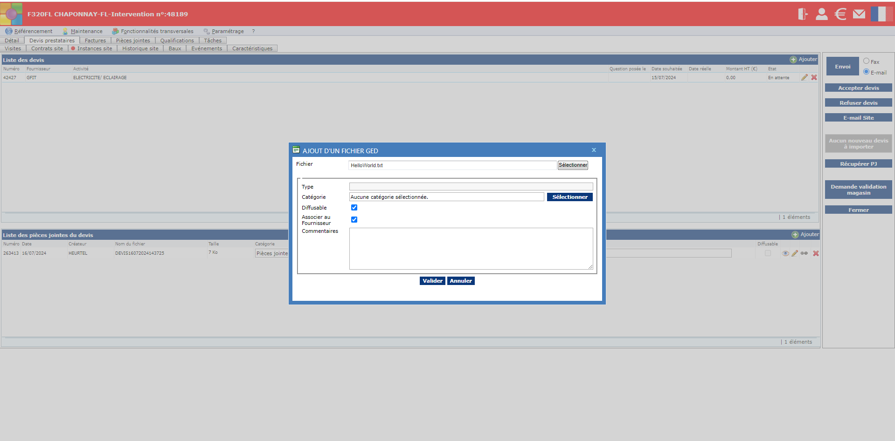
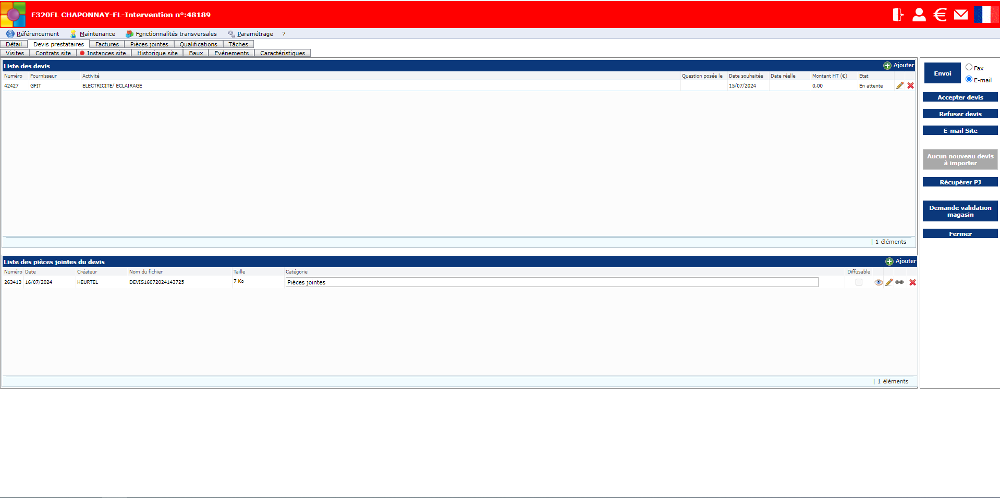
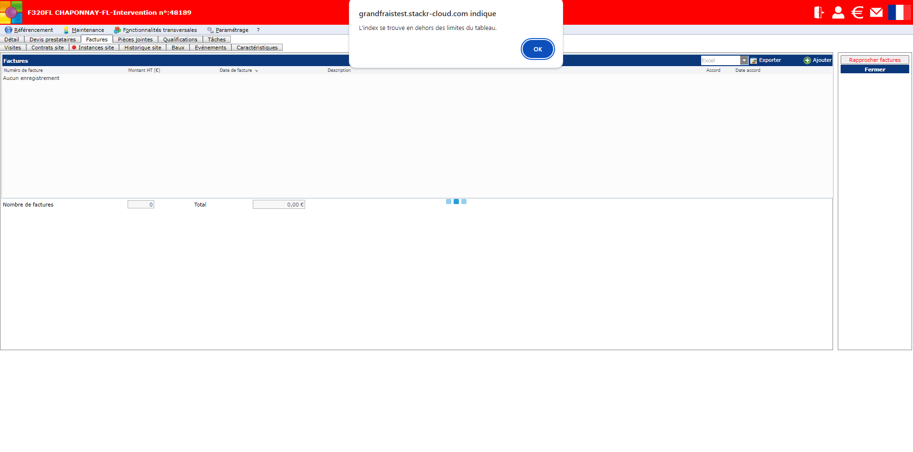
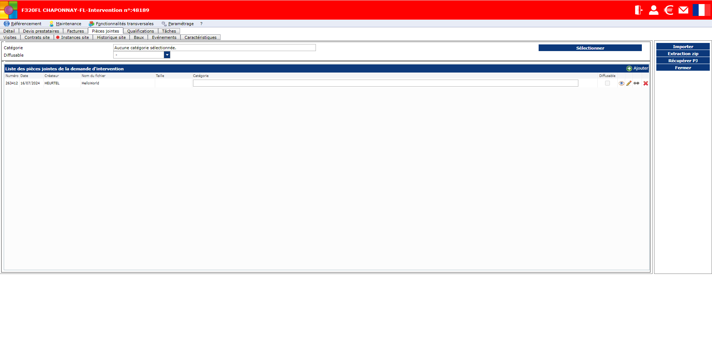
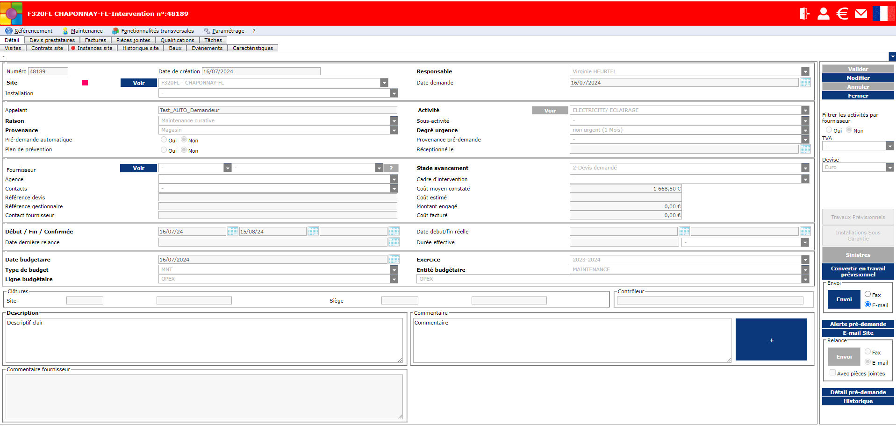

# GDM

### Quelques remarques...

- **Chemins des fichiers**  
Pour que ces tests fonctionnent sur un autre dépôt GIT, il faut faire attention à modifier :   
-le chemin vers la pièce jointe (ici : `GDM/attachments/HelloWorld.txt`)  
-le chemin vers le json qui stocke les données (ici : `GDM/gdm_data.json`)

- **Wait for Timeout**  
Beaucoup de page.waitForTimeout() ont été utilisés pour essayer garantir le chargement des pages, qui sont aléatoires... (la fonction waitTillHTMLRendered ne fonctionnait pas non plus...)  
Ainsi, certains tests échouent de temps en temps pour des raisons inconnues...

- **Problème fonctionnel**  
-Dans "Envoi de la demande de devis" (devis_demande_envoi.spec.ts) et dans "Enregistrement des devis reçus" (devis_enregistrement.spec.ts), la possibilité d'ajouter un devis en pièce jointe a été désactivée (click sur le bouton "Annuler") car elle ne semblait pas marcher fonctionnellement et générait des bugs...  

- **Autres**  
-Dans "Acceptation du devis" (devis_recus_acceptation.spec.ts), le test de vérification du stade d'avancement en rouge n'a pas été fait : la couleur semblait disparaître dès la première vue l'utilisateur, ce qui complexifiait la recherche de selecteur et de styles pour réaliser ce test...  
-Dans "Devis-reçus Actualisation de la DI" (devis_recus_actualisation_DI.spec.ts), le test de l'apparition du carré rouge a été déplacé dans le test suivant "Envoi d'une demande au prestataire" (demande_prestataires_envoi.spec.ts) pour des raisons de simplicité   

***Detail du problème fonctionnel:***  

• Capture 1 :   
On clique sur le bouton "Ajouter" de "Liste des pièces jointes du devis"  
Une fenêtre s'ouvre et on choisit notre fichier.  
=> On remarque que le Type n'est PAS modifiable.   

• Capture 2 :  
On clique sur le bouton "Valider"  
=> On remarque que le nom de la pièce jointe n'apparaît PAS dans "Liste des pièces jointes du devis"  

• Capture 3 :  
Si on clique sur l'onglet "Pièces Jointes"
=> On remarque qu'une erreur s'affiche

• Capture 4 :  
En enlevant le message d'erreur, on voit bien notre pièce jointe.  

• Capture 5 :   
Mais il devient alors impossible de cliquer sur n'importe quel onglet.  
En essayant de recharger la page, on se rend compte que l'onglet "Devis prestataires" ne marche plus (cliquer dessus ne fait rien)  

